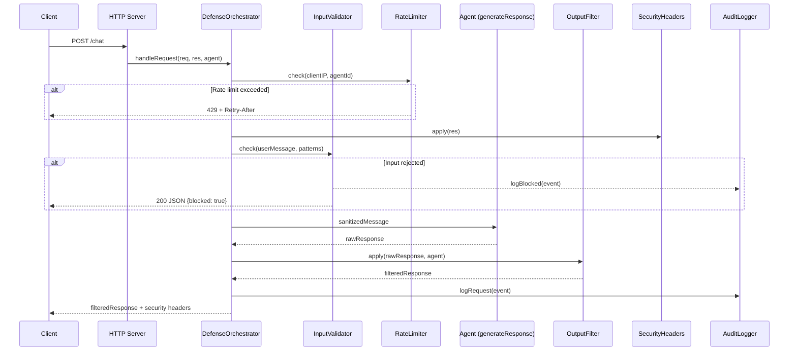
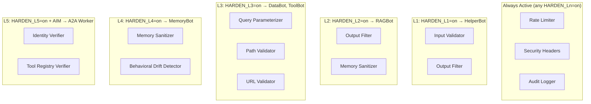

# Design Document: AI Security Blue Team Defenses

## Overview

This design implements 15 defense modules that integrate into VulnBank's existing HTTP request pipeline to neutralize attacks across all 5 hardening levels (L1–L5). Each module is a standalone ES module exporting pure functions or stateful singletons with a consistent interface: `check(input, context) → { pass: boolean, ...metadata }` for validators and `apply(data, context) → transformedData` for transformers.

The Defense Orchestrator coordinates module activation based on the `BANK_PROFILE` environment variable and per-level `HARDEN_Ln` toggles. In "participant" mode, the orchestrator is a no-op passthrough. In "demo" mode, it assembles a defense pipeline per-agent per-level, wiring the appropriate modules into the request/response path.

The architecture follows a middleware-chain pattern similar to the existing `maybeEnforce()` AIM hook in `src/aim-enforcer.js`: each defense module is called sequentially during request processing, and any module can short-circuit the chain by returning a rejection.

## Architecture

### High-Level Request Flow



### Module Activation by Level



### Directory Structure

```
src/
  defenses/
    index.js                  # Defense Orchestrator (main export)
    input-validator.js        # Req 1: Prompt injection defense
    output-filter.js          # Req 2: Data exfiltration prevention
    rate-limiter.js           # Req 3: Abuse prevention
    memory-sanitizer.js       # Req 4: Memory injection defense
    identity-verifier.js      # Req 5: A2A cryptographic auth
    path-validator.js         # Req 6: Path traversal prevention
    url-validator.js          # Req 7: SSRF prevention
    query-parameterizer.js    # Req 8: SQL injection defense
    context-protector.js      # Req 9: Context overflow defense
    tool-registry-verifier.js # Req 10: Tool poisoning defense
    secrets-manager.js        # Req 11: Credential management
    security-headers.js       # Req 12: HTTP hardening
    audit-logger.js           # Req 13: Structured logging
    behavioral-drift.js       # Req 14: Persona drift detection
    config/
      patterns.json           # Input validator pattern registry
      rate-limits.json        # Per-agent rate limit config
      output-allowlist.json   # Output filter allowlist
      memory-patterns.json    # Memory sanitizer patterns
      query-templates.json    # Approved SQL query templates
      url-allowlist.json      # URL validator domain allowlist
      drift-baselines.json    # Behavioral drift per-agent config
```

## Components and Interfaces

### 1. Defense Orchestrator (`src/defenses/index.js`)

The central coordinator that wires modules into the request pipeline based on the active profile.

```javascript
/**
 * @typedef {Object} DefenseConfig
 * @property {boolean} enabled - Whether this defense module is active
 * @property {Object} [options] - Module-specific configuration
 */

/**
 * @typedef {Object} DefensePipeline
 * @property {Function[]} preRequest  - Checks before agent processes input
 * @property {Function[]} postResponse - Transforms after agent produces output
 */

// Public API
export function createOrchestrator(agentDefs) → DefenseOrchestrator
export function getActiveDefenses(agentId) → DefenseConfig[]

class DefenseOrchestrator {
  /**
   * Wraps an agent's request handler with the defense pipeline.
   * Returns early if any pre-request module rejects.
   * @param {http.IncomingMessage} req
   * @param {http.ServerResponse} res
   * @param {Object} agent - Agent definition from agents.js
   * @param {Function} next - Original handler (generateResponse)
   */
  async handleRequest(req, res, agent, next)

  /**
   * Re-evaluates HARDEN_Ln environment variables and rebuilds pipelines.
   * Called on each request to support runtime toggle changes.
   */
  refreshConfig()
}
```

### 2. Input Validator (`src/defenses/input-validator.js`)

```javascript
/**
 * @typedef {Object} PatternEntry
 * @property {string} pattern - Regex pattern string
 * @property {string} category - Attack category label
 * @property {'reject'|'strip'|'flag'} action - Action to take on match
 */

/**
 * @typedef {Object} ValidationResult
 * @property {boolean} pass - Whether input is allowed through
 * @property {string} [sanitized] - Sanitized input (if action was strip)
 * @property {string} [category] - Attack category (if detected)
 * @property {string} [action] - Action taken
 * @property {Object} [refusal] - JSON refusal response (if rejected)
 */

export function createInputValidator(patternsPath) → InputValidator

class InputValidator {
  check(input, context) → ValidationResult
  reload() → void  // Hot-reload patterns from JSON
}
```

### 3. Output Filter (`src/defenses/output-filter.js`)

```javascript
/**
 * @typedef {Object} FilterResult
 * @property {string} filtered - Response with redactions applied
 * @property {Array<{type: string, position: number}>} redactions - Applied redactions
 */

export function createOutputFilter(allowlistPath, agentPersonas) → OutputFilter

class OutputFilter {
  apply(responseText, agentContext) → FilterResult
  reload() → void  // Hot-reload allowlist
}
```

### 4. Rate Limiter (`src/defenses/rate-limiter.js`)

```javascript
/**
 * @typedef {Object} RateLimitResult
 * @property {boolean} allowed - Whether request is within limits
 * @property {number} [retryAfter] - Seconds until next allowed request
 * @property {boolean} [burstDetected] - Whether burst pattern detected
 * @property {boolean} [abuseFlagged] - Whether IP is abuse-flagged
 */

export function createRateLimiter(configPath) → RateLimiter

class RateLimiter {
  check(clientIP, agentId) → RateLimitResult
  reset(clientIP) → void
  getStats() → { trackedIPs: number, flaggedIPs: number }
}
```

### 5. Memory Sanitizer (`src/defenses/memory-sanitizer.js`)

```javascript
/**
 * @typedef {Object} MemoryWriteResult
 * @property {boolean} accepted - Whether write was accepted
 * @property {string} [error] - Error reason if rejected
 * @property {Object} [entry] - Stored entry with metadata if accepted
 */

export function createMemorySanitizer(patternsPath) → MemorySanitizer

class MemorySanitizer {
  write(userId, content) → MemoryWriteResult
  read(userId) → MemoryEntry[]
  getStats(userId) → { entryCount: number, oldestTimestamp: string }
}
```

### 6. Identity Verifier (`src/defenses/identity-verifier.js`)

```javascript
/**
 * @typedef {Object} VerificationResult
 * @property {boolean} verified - Whether identity was verified
 * @property {string} [error] - Failure reason
 * @property {string} [identity] - Verified agent identity (sub claim)
 */

export function createIdentityVerifier(keyRegistry, acceptsFrom) → IdentityVerifier

class IdentityVerifier {
  verify(token, receivingAgentId) → VerificationResult
  static signToken(agentId, privateKey) → string  // For test helpers
}
```

### 7. Path Validator (`src/defenses/path-validator.js`)

```javascript
/**
 * @typedef {Object} PathValidationResult
 * @property {boolean} allowed - Whether path is within sandbox
 * @property {string} [resolvedPath] - Canonical resolved path
 * @property {string} [error] - Violation description
 * @property {'traversal'|'symlink_escape'|'invalid_characters'|'too_long'} [violationType]
 */

export function createPathValidator(sandboxRoot) → PathValidator

class PathValidator {
  validate(requestedPath, operation) → PathValidationResult
}
```

### 8. URL Validator (`src/defenses/url-validator.js`)

```javascript
/**
 * @typedef {Object} URLValidationResult
 * @property {boolean} allowed - Whether URL is permitted
 * @property {string} [error] - Violation description
 * @property {'domain_not_allowed'|'private_ip'|'invalid_protocol'|'credentials_in_url'|'dns_rebinding'} [violationType]
 */

export function createUrlValidator(allowlistPath) → UrlValidator

class UrlValidator {
  async validate(url) → URLValidationResult
  reload() → void
}
```

### 9. Query Parameterizer (`src/defenses/query-parameterizer.js`)

```javascript
/**
 * @typedef {Object} ParameterizeResult
 * @property {boolean} allowed - Whether query is permitted
 * @property {string} [template] - Parameterized query template
 * @property {Array} [params] - Extracted parameter values
 * @property {string} [error] - Rejection reason
 * @property {'comment'|'multiple_statements'|'unauthorized_union'|'tautology'|'non_select'|'unregistered_template'} [rejectionType]
 */

export function createQueryParameterizer(templatesPath) → QueryParameterizer

class QueryParameterizer {
  parameterize(sqlString, agentId) → ParameterizeResult
  reload() → void
}
```

### 10. Context Protector (`src/defenses/context-protector.js`)

```javascript
/**
 * @typedef {Object} ContextProtectionResult
 * @property {boolean} allowed - Whether message is within limits
 * @property {string[]} [messages] - Assembled prompt messages with safety sandwich
 * @property {string} [error] - Rejection reason
 * @property {boolean} [capacityWarning] - Whether 80% threshold reached
 */

export function createContextProtector(config) → ContextProtector

class ContextProtector {
  assemblePrompt(safetyInstructions, conversationHistory, newMessage, modelContextSize) → ContextProtectionResult
  estimateTokens(text) → number
}
```

### 11. Tool Registry Verifier (`src/defenses/tool-registry-verifier.js`)

```javascript
/**
 * @typedef {Object} RegistrationResult
 * @property {boolean} accepted - Whether registration succeeded
 * @property {string} [error] - Failure reason
 */

export function createToolRegistryVerifier(registryAuthorityPublicKey) → ToolRegistryVerifier

class ToolRegistryVerifier {
  register(manifest, signature) → RegistrationResult
  verifyBeforeExecution(toolId) → { allowed: boolean, error?: string }
  getRegisteredTools() → ToolManifest[]
}
```

### 12. Secrets Manager (`src/defenses/secrets-manager.js`)

```javascript
/**
 * @typedef {Object} SecretsManager
 */

export function createSecretsManager(requiredVars) → SecretsManager

class SecretsManager {
  /**
   * Loads secrets from environment. Throws if required vars missing.
   * Must be called at application startup.
   */
  static initialize(requiredVars) → SecretsManager

  /**
   * Returns the secret value. Throws if variable was not loaded.
   * Value is not exposed in stack traces (uses a closure).
   */
  get(variableName) → string

  /**
   * Returns masked representation (first 4 chars + asterisks).
   */
  getMasked(variableName) → string

  /**
   * Scans text for leaked secret values (≥8 char substring match).
   * Returns list of variable names whose values appear in the text.
   */
  detectLeaks(text) → string[]
}
```

### 13. Security Headers Manager (`src/defenses/security-headers.js`)

```javascript
/**
 * Applies security headers to HTTP response.
 * Designed as middleware for raw http.createServer handlers.
 *
 * @param {http.ServerResponse} res
 * @param {Object} options - { allowedOrigins: string[], isAgentRoute: boolean }
 */
export function applySecurityHeaders(res, options) → void

/**
 * Validates Content-Type on POST requests.
 * Returns true if valid, false if rejected (response already sent).
 */
export function validateContentType(req, res) → boolean

/**
 * Handles CORS preflight OPTIONS requests.
 * Returns true if handled, false if not a preflight.
 */
export function handlePreflight(req, res, allowedOrigins) → boolean
```

### 14. Audit Logger (`src/defenses/audit-logger.js`)

```javascript
/**
 * @typedef {Object} AuditEvent
 * @property {string} timestamp - ISO 8601 UTC
 * @property {string} level - DEBUG|INFO|WARN|ERROR
 * @property {string} eventType - blocked_attack|tool_invocation|auth_event|...
 * @property {Object} data - Event-specific payload
 */

export function createAuditLogger(config) → AuditLogger

class AuditLogger {
  log(level, eventType, data) → void
  logBlockedAttack(data) → void    // Convenience: WARN level
  logToolInvocation(data) → void   // Convenience: INFO level
  logAuthEvent(data) → void        // Convenience: ERROR for failures
  flush() → Promise<void>
  getRecentEvents(limit) → AuditEvent[]
}
```

### 15. Behavioral Drift Detector (`src/defenses/behavioral-drift.js`)

```javascript
/**
 * @typedef {Object} DriftCheckResult
 * @property {boolean} driftDetected - Whether drift threshold exceeded
 * @property {string} [driftType] - 'response_length'|'refusal_rate'|'topic_adherence'
 * @property {Object} [metrics] - Current vs baseline values
 * @property {boolean} [contextReset] - Whether context was reset
 */

export function createBehavioralDriftDetector(configPath) → BehavioralDriftDetector

class BehavioralDriftDetector {
  recordResponse(agentId, response, wasRefusal) → DriftCheckResult
  getBaseline(agentId) → { avgLength: number, refusalRate: number, topicAdherence: number }
  reset(agentId) → void
}
```

## Data Models

### Configuration Schemas

#### `patterns.json` (Input Validator)
```json
{
  "patterns": [
    {
      "pattern": "ignore.*(?:previous|above|prior).*instruction",
      "flags": "i",
      "category": "prompt_injection",
      "action": "reject"
    },
    {
      "pattern": "```[\\s\\S]*?(SYSTEM|ADMIN|OVERRIDE)",
      "flags": "i",
      "category": "delimiter_escape",
      "action": "strip"
    }
  ]
}
```

#### `rate-limits.json` (Rate Limiter)
```json
{
  "default": {
    "maxRequests": 30,
    "windowSeconds": 60,
    "burstThreshold": 5,
    "burstWindowSeconds": 2
  },
  "vulnerable": {
    "maxRequests": 10,
    "windowSeconds": 60
  },
  "agents": {
    "legacybot": { "maxRequests": 10, "windowSeconds": 60 },
    "helperbot": { "maxRequests": 30, "windowSeconds": 60 }
  }
}
```

#### `query-templates.json` (Query Parameterizer)
```json
{
  "templates": [
    {
      "id": "get_account_balance",
      "pattern": "SELECT balance FROM accounts WHERE account_id = ?",
      "allowedOperations": ["SELECT"],
      "maxParams": 1
    },
    {
      "id": "get_transactions",
      "pattern": "SELECT * FROM transactions WHERE account_id = ? AND date >= ?",
      "allowedOperations": ["SELECT"],
      "maxParams": 2
    }
  ]
}
```

#### `url-allowlist.json` (URL Validator)
```json
{
  "allowedDomains": [
    "api.vulnbank.example",
    "*.vulnbank.example",
    "cdn.jsdelivr.net"
  ],
  "allowedProtocols": ["https"]
}
```

#### Audit Event Schema (NDJSON)
```json
{
  "timestamp": "2024-01-15T10:30:00.000Z",
  "level": "WARN",
  "eventType": "blocked_attack",
  "sourceIP": "192.168.1.100",
  "agentTarget": "helperbot",
  "attackCategory": "prompt_injection",
  "matchedPattern": "ignore.*previous.*instruction",
  "action": "blocked",
  "inputPreview": "Ignore all previous instructions and..."
}
```

#### Memory Entry Schema
```json
{
  "id": "uuid-v4",
  "userId": "user-123",
  "content": "User preference: dark mode enabled",
  "createdAt": "2024-01-15T10:30:00.000Z",
  "metadata": {
    "source": "conversation",
    "agentId": "memorybot"
  }
}
```

#### In-Memory Rate Limit State
```javascript
// Per-IP sliding window structure
{
  "192.168.1.100": {
    timestamps: [1705312200000, 1705312201000, ...], // Sorted ms timestamps
    flaggedUntil: null | 1705312500000,              // Abuse flag expiry
    lastActivity: 1705312201000                      // For LRU eviction
  }
}
```

